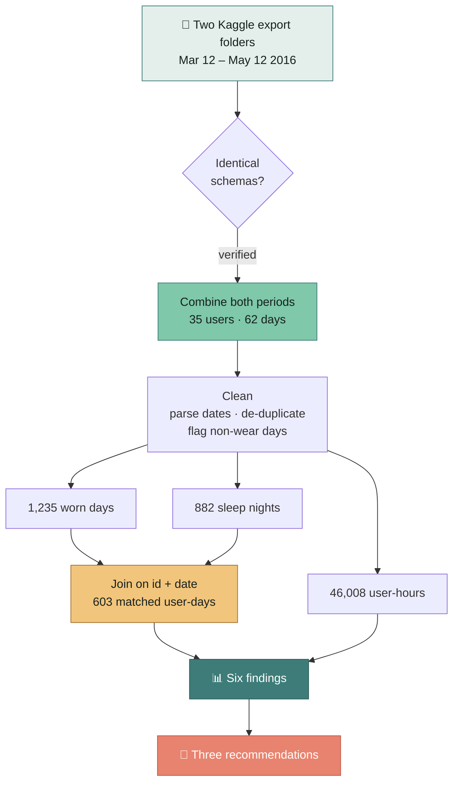

<div align="center">

# Sit Less, Sleep Better

### A Bellabeat marketing analysis of two months of Fitbit tracker data

[](https://www.r-project.org/)
[](https://www.tidyverse.org/)
[](https://rmarkdown.rstudio.com/)
[](https://www.kaggle.com/datasets/arashnic/fitbit)


**Google Data Analytics Capstone · Case Study 2**
Mohammad Saeed Angiz

<br>


</div>

---

## The one-sentence version

> The wellness market sells **step counts**. This data says the habit that actually
> predicts good sleep is **not sitting still** — and it does so about **three times more
> strongly** than steps do.

---

## Headline numbers

| Metric | Value | What it means |
|:--|--:|:--|
| Median device wear rate | **63%** | No user wore it 80%+ of days |
| Average sedentary time | **15.9 h/day** | 80% of all tracked time |
| Nights under 7 hours | **49.1%** | Half the nights fall short |
| Days reaching 10,000 steps | **34.0%** | The default goal is unreachable for most |
| Sedentary time ↔ sleep | **r = −0.48** | The core finding |
| Step count ↔ sleep | **r = −0.15** | Three times weaker |

---

## How the analysis runs



---

## What most analyses of this dataset miss

The Kaggle download ships **two export folders** covering consecutive months. Nearly every
published version of this case study uses only the second one — 33 users, 31 days.

Both folders carry an **identical `dailyActivity_merged.csv` schema**, so this analysis
combines them:

| | Typical analysis | This analysis |
|:--|--:|--:|
| Users | 33 | **35** |
| Days covered | 31 | **62** |
| Sleep nights | 410 | **882** |

<details>
<summary><b>⚠️ The trap that comes with doing this</b> — click to expand</summary>

<br>

Pooling both folders to plot weekly active users produces a beautiful rising-then-falling
curve that looks exactly like user churn. **It is an artefact.**

The March export contains only **2–4 users in its first two weeks** because recruitment was
still ramping up. Nobody quit — they hadn't joined yet.

Any retention chart must therefore use the **April window alone**, where all 33 users are
present from day one. This is documented in the report and enforced in the code.

</details>

---

## The six findings

### 1 · The device comes off, and often


The median user logged steps on **63%** of available days. **Not one** of the 35 users wore
the device on 80% or more of days.

> A tracker spending a third of its life in a drawer cannot deliver on sleep, stress or
> cycle insight. Engagement is the ceiling on every other feature.

### 2 · The 10,000-step goal is a wall, not a target


Mean daily steps: **8,057**. Only **34%** of days reached 10,000 — and no day of the week
averaged above it.


> For half the user base the default goal is unreachable. A goal missed daily stops being
> motivation and becomes a reminder of failure.

### 3 · The problem is sitting, not exercising


**15.9 sedentary hours** per day against **21.7 very-active minutes**. On 55.8% of days,
combined moderate-plus-vigorous activity fell under 30 minutes.

> The addressable opportunity is the 15.9 hours, not the 22 minutes.

### 4 · Activity clusters at two predictable peaks


Peaks at **12–2 p.m.** and **5–7 p.m.** — 7 p.m. is the busiest hour. Quietest waking hours
are 7 a.m., 10 p.m. and 11 p.m.

> Notification timing is guesswork for most apps. These are the windows when users are
> already in motion.

### 5 · Half of all nights fall short — and sitting predicts it


Across **603 matched user-days**, sedentary minutes correlate with sleep at **r = −0.48**,
against only **r = −0.15** for step count.

> This is the most actionable relationship in the dataset. Not *"walk more, sleep better"*
> but **"sit less, sleep better"** — a claim no major competitor is making.

### 6 · Adoption collapses when effort is required


Activity **100%** → Sleep **71%** → Weight **37%**. And **64%** of weight entries were typed
in by hand, a median of **2 logs per user** across two months.

> Each increment of friction costs roughly a third of the user base.

---

## Recommendations for the Bellabeat app

| # | Recommendation | Evidence | Marketing line |
|:--|:--|:--|:--|
| **1** | Replace the fixed step goal with an adaptive one | 34% of days reach 10k; 18/35 users average under 7,500 | *"A goal that meets you where you are."* |
| **2** | Market on the sit-less / sleep-better link | r = −0.48 vs r = −0.15 | *"Sit less today, sleep better tonight."* |
| **3** | Time notifications to the two peaks | 12–2 p.m. and 5–7 p.m. | *"Nudges when you're already moving."* |

<details>
<summary>Three supporting recommendations</summary>

<br>

**4 · Make the Leaf's form factor the retention pitch.** Wear rate caps everything else.
The jewellery design answers a real constraint, not a cosmetic one — market it as
*"the tracker you don't take off"* and reward consecutive days **worn**, not steps achieved.

**5 · Eliminate manual logging.** Weight logging reached 37% of users with 64% of entries
typed by hand. Assume any hand-entry feature is dead on arrival.

**6 · Position membership content around midweek.** Sleep bottoms out on Tuesday, activity
on Sunday. Schedule coaching for Sunday evening and Tuesday morning.

</details>

---

## Limitations

**These findings should be validated before any budget is committed.**

| Limitation | Detail |
|:--|:--|
| Sample size | 35 participants — far too few to generalise |
| **Gender data** | **Not recorded** — yet Bellabeat sells exclusively to women |
| Data age | Collected 2016; hardware and expectations have moved on |
| Recruitment | Self-selected MTurk volunteers |
| Causality | The sedentary–sleep link is an association; direction untested |
| Sleep aggregation | March nights rely on a 6 a.m. night-boundary assumption |

**Next steps, cheapest first:** A/B test the notification windows → replicate on Bellabeat's
own telemetry where gender and age are known → test the adaptive goal on 30-day retention →
survey lapsed users on *why the device came off*.

---

## Repository structure

```
.
├── README.md
├── .gitignore                    # excludes the raw CSVs (604 MB)
├── images/
│   ├── findings.gif              # animated summary
│   ├── build_gif.sh              # regenerates it with ffmpeg
│   └── *.png                     # 10 charts at 200 dpi
└── analysis/
    ├── bellabeat_case_study.Rmd  # the full report
    ├── bellabeat_case_study.html # knitted output
    └── bellabeat_kaggle.ipynb    # Jupyter version for Kaggle
```

## Reproducing this

```r
# 1. Download the data (CC0, ~600 MB unzipped)
#    https://www.kaggle.com/datasets/arashnic/fitbit

# 2. Point BASE at the unzipped folder, then knit
rmarkdown::render("analysis/bellabeat_case_study.Rmd")
```

Requires R 4.x with `tidyverse`, `lubridate`, `janitor` and `scales`.

Every figure quoted in the report is computed at knit time via inline R — nothing is typed
by hand, so the numbers cannot drift out of sync with the data.

---

## Data source

**FitBit Fitness Tracker Data** — made available by **Mobius** on Kaggle under **CC0
(public domain)**. Thirty-plus Fitbit users consented via an Amazon Mechanical Turk survey
to submit personal tracker data between 12 March and 12 May 2016.

[](https://www.kaggle.com/datasets/arashnic/fitbit)

<div align="center">
<sub>Analysis in R · Mohammad Saeed Angiz · 2026</sub>
</div>
