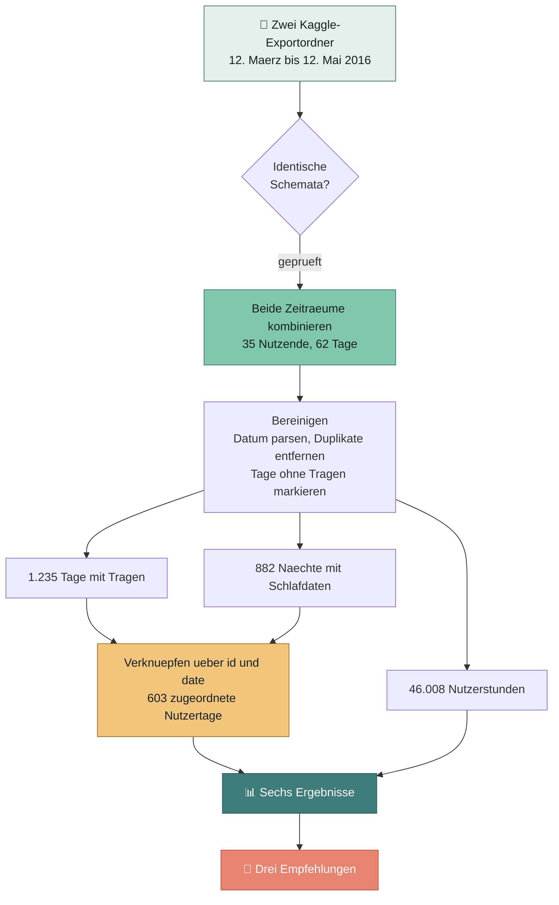

<div align="center">

# Weniger sitzen, besser schlafen

### Eine Bellabeat-Marketinganalyse von zwei Monaten Fitbit-Trackerdaten

[](https://www.r-project.org/)
[](https://www.tidyverse.org/)
[](https://rmarkdown.rstudio.com/)
[](https://www.kaggle.com/datasets/arashnic/fitbit)


**Google Data Analytics Capstone, Fallstudie 2**
Mohammad Saeed Angiz

**[English](README.md) · Deutsch · [فارسی](README_fa.md)**

<br>


</div>

---

## Die Kernaussage in einem Satz

> Der Wellnessmarkt verkauft **Schrittzahlen**. Diese Daten zeigen, dass die
> Gewohnheit, die guten Schlaf tatsaechlich vorhersagt, das **Nicht-Stillsitzen**
> ist, und zwar etwa **dreimal staerker** als Schritte es tun.

---

## Die wichtigsten Zahlen

| Kennzahl | Wert | Was das bedeutet |
|:--|--:|:--|
| Mediane Tragequote | **63 %** | Keine Person trug das Geraet an 80 % oder mehr der Tage |
| Durchschnittliche Sitzzeit | **15,9 Std./Tag** | 80 % der gesamten erfassten Zeit |
| Naechte unter 7 Stunden | **49,1 %** | Die Haelfte der Naechte bleibt darunter |
| Tage mit 10.000 Schritten | **34,0 %** | Das voreingestellte Ziel ist fuer die meisten unerreichbar |
| Sitzzeit und Schlaf | **r = −0,48** | Das zentrale Ergebnis |
| Schrittzahl und Schlaf | **r = −0,15** | Dreimal schwaecher |

---

## Ablauf der Analyse



---

## Was die meisten Analysen dieses Datensatzes uebersehen

Der Kaggle-Download enthaelt **zwei Exportordner** fuer aufeinanderfolgende
Monate. Nahezu jede veroeffentlichte Fassung dieser Fallstudie nutzt nur den
zweiten davon: 33 Nutzende, 31 Tage.

Beide Ordner haben ein **identisches Schema in `dailyActivity_merged.csv`**,
deshalb kombiniert diese Analyse sie:

| | Uebliche Analyse | Diese Analyse |
|:--|--:|--:|
| Nutzende | 33 | **35** |
| Abgedeckte Tage | 31 | **62** |
| Naechte mit Schlafdaten | 410 | **882** |

<details>
<summary><b>⚠️ Die Falle, die damit einhergeht</b> (zum Aufklappen anklicken)</summary>

<br>

Beide Ordner zusammenzufassen und die woechentlich aktiven Nutzenden zu plotten
erzeugt eine schoen ansteigende und dann abfallende Kurve, die genau wie
Nutzerabwanderung aussieht. **Das ist ein Artefakt.**

Der Maerz-Export enthaelt in den ersten beiden Wochen nur **2 bis 4 Nutzende**,
weil die Rekrutierung noch anlief. Niemand ist abgesprungen, sie waren noch nicht
dabei.

Jede Auswertung zur Nutzerbindung muss deshalb **allein den April-Zeitraum**
verwenden, in dem alle 33 Nutzenden vom ersten Tag an vorhanden sind. Das ist im
Bericht dokumentiert und im Code durchgesetzt.

</details>

---

## Die sechs Ergebnisse

### 1 · Das Geraet wird abgelegt, und das haeufig


Die mediane Person erfasste an **63 %** der verfuegbaren Tage Schritte. **Keine
einzige** der 35 Personen trug das Geraet an 80 % oder mehr der Tage.

> Ein Tracker, der ein Drittel seines Lebens in einer Schublade verbringt, kann
> weder zu Schlaf noch zu Stress oder Zyklus verlaessliche Erkenntnisse liefern.
> Die Nutzungshaeufigkeit ist die Obergrenze fuer jede weitere Funktion.

### 2 · Das Ziel von 10.000 Schritten ist eine Mauer, kein Ziel


Mittlere Tagesschrittzahl: **8.057**. Nur **34 %** der Tage erreichten 10.000,
und kein Wochentag lag im Mittel darueber.


> Fuer die Haelfte der Nutzenden ist das voreingestellte Ziel unerreichbar. Ein
> Ziel, das taeglich verfehlt wird, wirkt nicht mehr motivierend, sondern
> erinnert an das Scheitern.

### 3 · Das Problem ist das Sitzen, nicht der fehlende Sport


**15,9 Sitzstunden** pro Tag gegenueber **21,7 intensiv aktiven Minuten**. An
55,8 % der Tage lag die Summe aus maessiger und intensiver Aktivitaet unter
30 Minuten.

> Der ansprechbare Hebel sind die 15,9 Stunden, nicht die 22 Minuten.

### 4 · Aktivitaet ballt sich an zwei vorhersehbaren Spitzen


Spitzen von **12 bis 14 Uhr** und von **17 bis 19 Uhr**, wobei 19 Uhr die
aktivste Stunde ist. Die ruhigsten Wachstunden sind 7 Uhr, 22 Uhr und 23 Uhr.

> Der Zeitpunkt von Benachrichtigungen ist bei den meisten Apps Raterei. In
> diesen Fenstern sind die Nutzenden ohnehin in Bewegung.

### 5 · Die Haelfte aller Naechte bleibt zu kurz, und Sitzen sagt das vorher


Ueber **603 zugeordnete Nutzertage** haengen Sitzminuten mit dem Schlaf bei
**r = −0,48** zusammen, gegenueber nur **r = −0,15** fuer die Schrittzahl.

> Das ist der Zusammenhang im Datensatz, aus dem sich am meisten ableiten laesst.
> Die Aussage lautet nicht *"mehr gehen, besser schlafen"*, sondern **"weniger
> sitzen, besser schlafen"**, eine Aussage, die kein grosser Wettbewerber trifft.

### 6 · Die Nutzung bricht ein, sobald Aufwand noetig wird


Aktivitaet **100 %** zu Schlaf **71 %** zu Gewicht **37 %**. Und **64 %** der
Gewichtseintraege wurden von Hand eingetippt, im Median **2 Eintraege pro Person**
ueber zwei Monate.

> Jede zusaetzliche Huerde kostet rund ein Drittel der Nutzenden.

---

## Empfehlungen fuer die Bellabeat-App

| Nr. | Empfehlung | Beleg | Werbeaussage |
|:--|:--|:--|:--|
| **1** | Das feste Schrittziel durch ein anpassungsfaehiges ersetzen | 34 % der Tage erreichen 10k; 18 von 35 Nutzenden liegen unter 7.500 | *"Ein Ziel, das dich dort abholt, wo du stehst."* |
| **2** | Ueber den Zusammenhang "weniger sitzen, besser schlafen" vermarkten | r = −0,48 gegenueber r = −0,15 | *"Heute weniger sitzen, heute Nacht besser schlafen."* |
| **3** | Benachrichtigungen auf die beiden Spitzen legen | 12 bis 14 Uhr und 17 bis 19 Uhr | *"Impulse, wenn du ohnehin in Bewegung bist."* |

<details>
<summary>Drei ergaenzende Empfehlungen</summary>

<br>

**4 · Die Bauform des Leaf zum Argument fuer die Bindung machen.** Die Tragequote
begrenzt alles andere. Die Schmuckform adressiert eine echte Einschraenkung, keine
aeusserliche. Als *"den Tracker, den du nicht ablegst"* vermarkten und Tage des
**Tragens** belohnen, nicht erreichte Schritte.

**5 · Manuelles Erfassen abschaffen.** Die Gewichtserfassung erreichte 37 % der
Nutzenden, 64 % der Eintraege wurden von Hand getippt. Es ist davon auszugehen,
dass jede Funktion mit Handeingabe von vornherein scheitert.

**6 · Mitgliedschaftsinhalte auf die Wochenmitte legen.** Der Schlaf erreicht am
Dienstag seinen Tiefpunkt, die Aktivitaet am Sonntag. Coaching-Inhalte fuer den
Sonntagabend und den Dienstagmorgen einplanen.

</details>

---

## Einschraenkungen

**Diese Ergebnisse sollten geprueft werden, bevor Budget gebunden wird.**

| Einschraenkung | Details |
|:--|:--|
| Stichprobengroesse | 35 Teilnehmende, viel zu wenige fuer eine Verallgemeinerung |
| **Angaben zum Geschlecht** | **Nicht erfasst**, obwohl Bellabeat ausschliesslich an Frauen verkauft |
| Alter der Daten | 2016 erhoben; Hardware und Erwartungen haben sich veraendert |
| Rekrutierung | Selbst ausgewaehlte MTurk-Freiwillige |
| Kausalitaet | Der Zusammenhang von Sitzzeit und Schlaf ist eine Assoziation; die Richtung ist ungeprueft |
| Aggregation der Schlafdaten | Die Maerz-Naechte beruhen auf einer Grenze um 6 Uhr morgens |

**Naechste Schritte, nach Kosten geordnet:** A/B-Test der Benachrichtigungsfenster,
dann die Analyse an Bellabeats eigenen Telemetriedaten wiederholen, wo Geschlecht
und Alter bekannt sind, dann das anpassungsfaehige Ziel an der Nutzung ueber
30 Tage testen, dann abgewanderte Nutzende befragen, *warum das Geraet abgelegt
wurde*.

---

## Aufbau des Repositorys

```
.
├── README.md                     # Englisch
├── README_de.md                  # Deutsch (diese Datei)
├── README_fa.md                  # Persisch
├── .gitignore                    # schliesst die Rohdaten aus (604 MB)
├── images/
│   ├── findings.gif              # animierte Zusammenfassung
│   ├── build_gif.sh              # erzeugt sie mit ffmpeg neu
│   └── *.png                     # 10 Diagramme mit 200 dpi
└── analysis/
    ├── bellabeat_case_study.Rmd     # der vollstaendige Bericht
    ├── bellabeat_case_study_de.Rmd  # deutsche Fassung
    ├── bellabeat_case_study_fa.Rmd  # persische Fassung
    └── bellabeat_kaggle.ipynb       # Jupyter-Fassung fuer Kaggle
```

## Analyse reproduzieren

```r
# 1. Daten herunterladen (CC0, rund 600 MB entpackt)
#    https://www.kaggle.com/datasets/arashnic/fitbit

# 2. BASE auf den entpackten Ordner setzen, dann rendern
rmarkdown::render("analysis/bellabeat_case_study_de.Rmd")
```

Benoetigt R 4.x mit `tidyverse`, `lubridate`, `janitor` und `scales`.

Jede im Bericht genannte Zahl wird beim Rendern ueber Inline-R berechnet. Nichts
wird von Hand eingetragen, die Zahlen koennen also nicht von den Daten abweichen.

---

## Datenquelle

**FitBit Fitness Tracker Data**, bereitgestellt von **Mobius** auf Kaggle unter
**CC0 (gemeinfrei)**. Ueber dreissig Fitbit-Nutzende haben ueber eine Umfrage bei
Amazon Mechanical Turk zugestimmt, ihre persoenlichen Trackerdaten zwischen dem
12. Maerz und dem 12. Mai 2016 zu uebermitteln.

[](https://www.kaggle.com/datasets/arashnic/fitbit)

---

### Hinweis zur Uebersetzung

Diese Datei ist eine **maschinelle Uebersetzung** der englischen Originalfassung
[README.md](README.md), angefertigt mit einem KI-Sprachmodell. Bei Abweichungen
ist das **englische Original massgeblich**. Diese Uebersetzung wurde nicht von
einer muttersprachlichen Fachperson geprueft.

<div align="center">
<sub>Analyse in R · Mohammad Saeed Angiz · 2026</sub>
</div>
