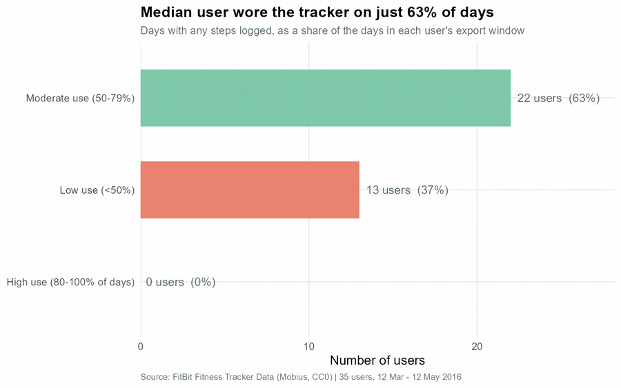
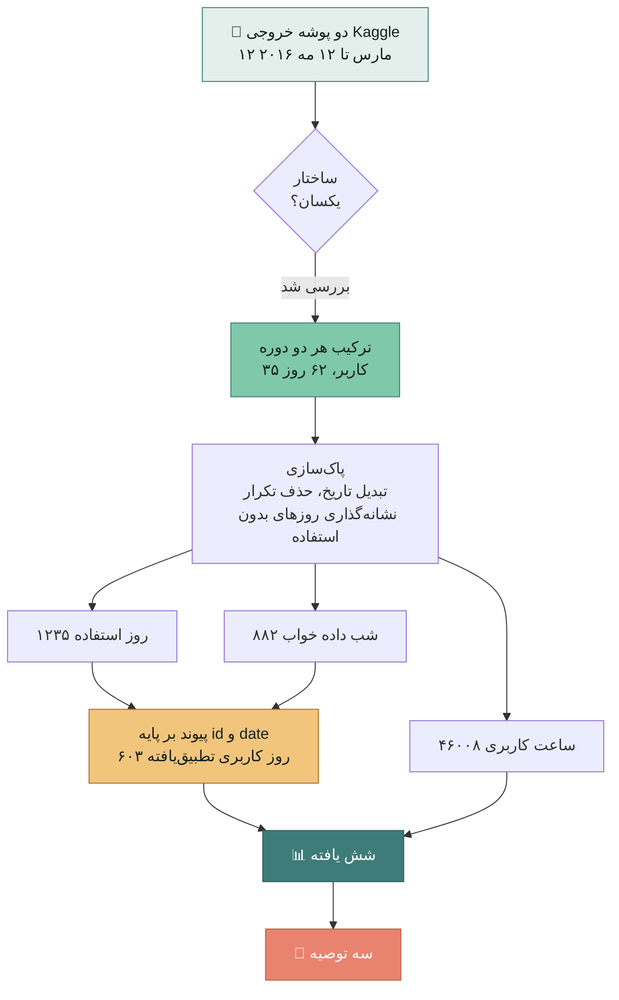
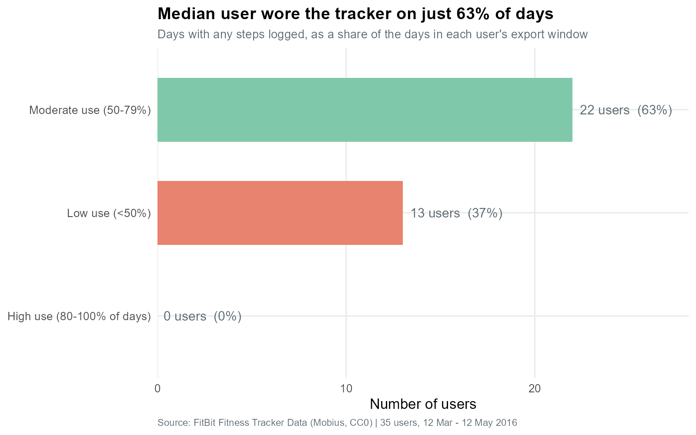
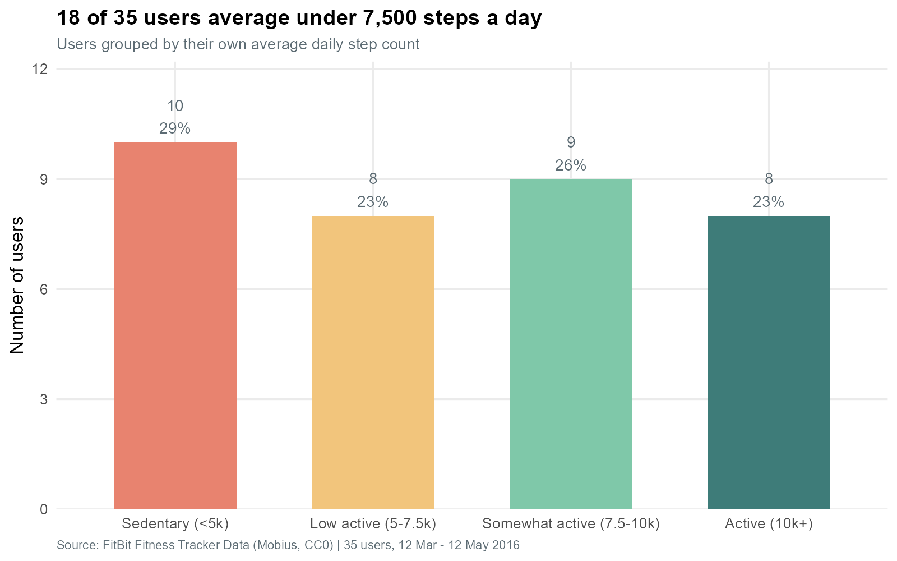
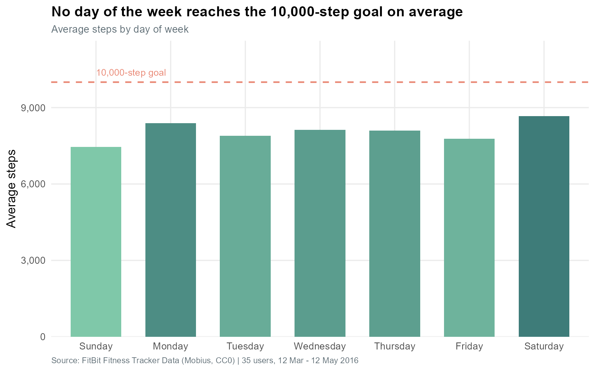
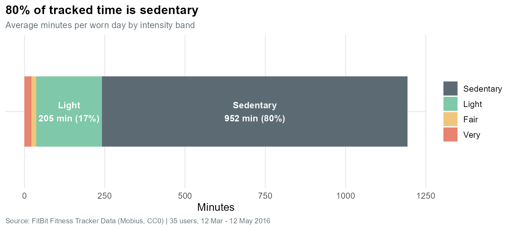
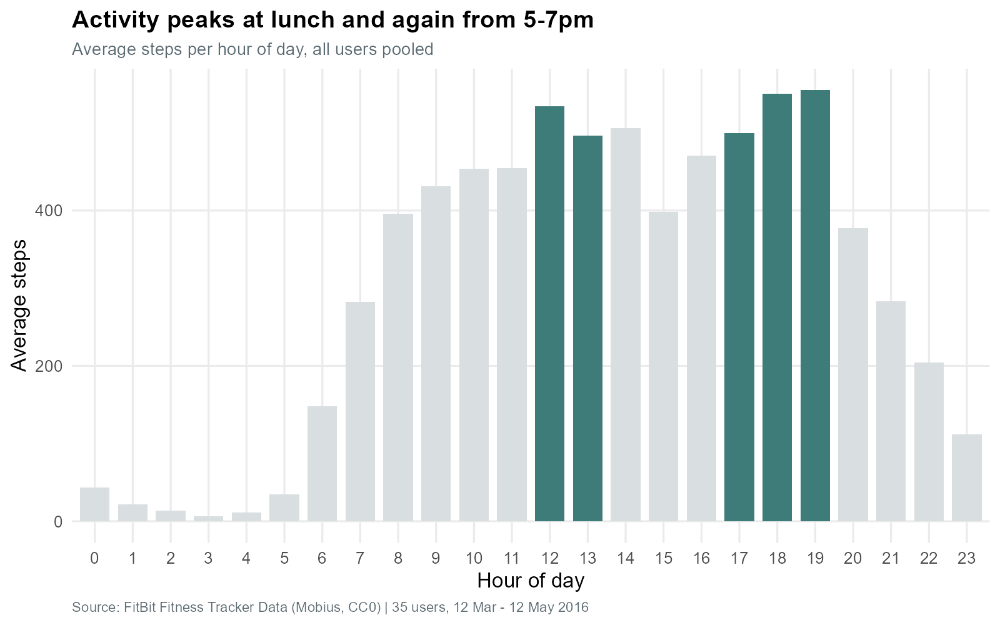
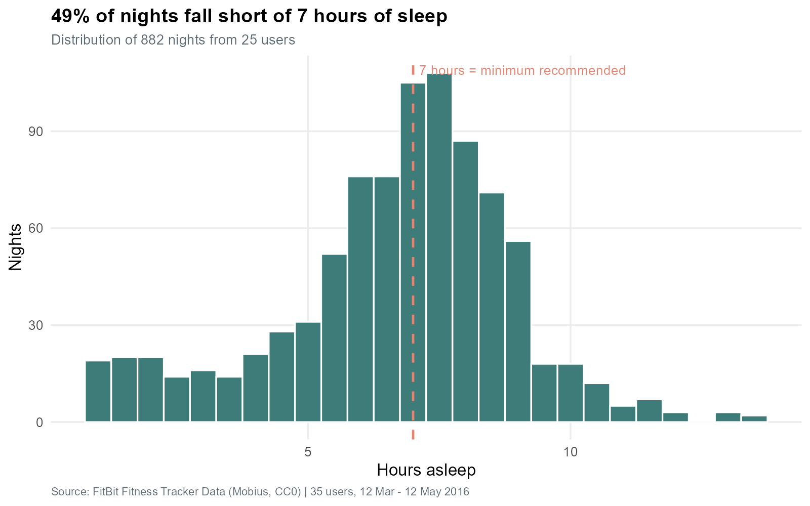
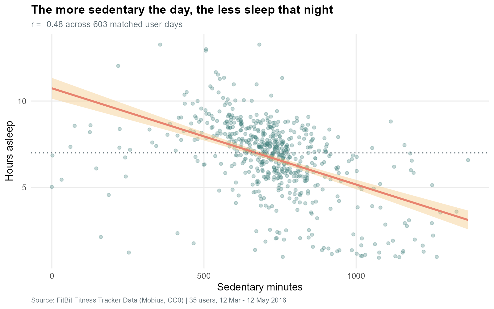
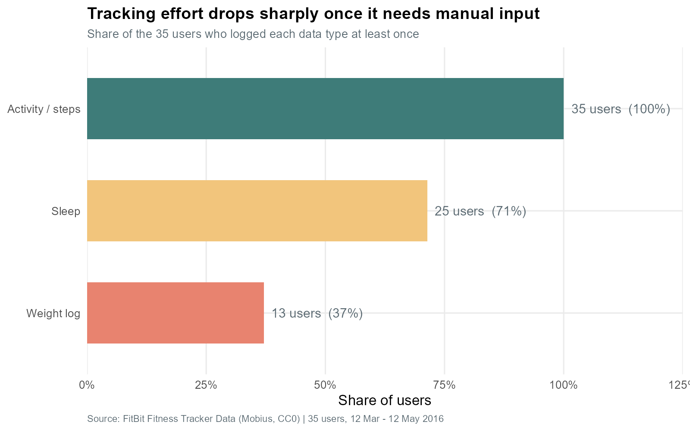

<div align="center">

# کمتر بنشین، بهتر بخواب

### تحلیل بازاریابی بلابیت بر پایه دو ماه داده ردیاب فیت‌بیت

[](https://www.r-project.org/)
[](https://www.tidyverse.org/)
[](https://rmarkdown.rstudio.com/)
[](https://www.kaggle.com/datasets/arashnic/fitbit)


**پروژه پایانی Google Data Analytics، مطالعه موردی ۲**
محمد سعید انگیز

**[English](README.md) · [Deutsch](README_de.md) · فارسی**

<br>



</div>

---

<div dir="rtl" align="right">

## خلاصه در یک جمله

> بازار سلامت و تندرستی **شمار قدم** می‌فروشد. این داده‌ها می‌گویند عادتی که در
> عمل خواب خوب را پیش‌بینی می‌کند **ننشستن** است، و این کار را تقریباً **سه برابر
> قوی‌تر** از قدم انجام می‌دهد.

</div>

---

## شاخص‌های کلیدی

| شاخص | مقدار | معنای آن |
|:--|--:|:--|
| میانه نرخ استفاده از دستگاه | **۶۳٪** | هیچ کاربری در ۸۰٪ یا بیشتر روزها از آن استفاده نکرد |
| میانگین زمان بی‌تحرکی | **۱۵٫۹ ساعت در روز** | ۸۰٪ کل زمان ثبت‌شده |
| شب‌های کمتر از ۷ ساعت | **۴۹٫۱٪** | نیمی از شب‌ها کوتاه‌اند |
| روزهای رسیدن به ۱۰٬۰۰۰ قدم | **۳۴٫۰٪** | هدف پیش‌فرض برای بیشتر افراد دست‌نیافتنی است |
| بی‌تحرکی و خواب | **r = −۰٫۴۸** | یافته اصلی |
| شمار قدم و خواب | **r = −۰٫۱۵** | سه برابر ضعیف‌تر |

---

## مسیر اجرای تحلیل



---

<div dir="rtl" align="right">

## آنچه بیشتر تحلیل‌های این مجموعه داده از قلم می‌اندازند

فایل دریافتی از Kaggle شامل **دو پوشه خروجی** برای دو ماه پیاپی است. تقریباً هر
نسخه منتشرشده از این مطالعه موردی تنها از پوشه دوم استفاده می‌کند: ۳۳ کاربر و
۳۱ روز.

هر دو پوشه در فایل `dailyActivity_merged.csv` **ساختار یکسانی** دارند، بنابراین
این تحلیل هر دو را ترکیب می‌کند:

</div>

| | تحلیل رایج | این تحلیل |
|:--|--:|--:|
| کاربران | ۳۳ | **۳۵** |
| روزهای پوشش‌داده‌شده | ۳۱ | **۶۲** |
| شب‌های دارای داده خواب | ۴۱۰ | **۸۸۲** |

<details>
<summary><b>⚠️ دامی که همراه این کار می‌آید</b> (برای باز شدن کلیک کنید)</summary>

<br>

<div dir="rtl" align="right">

اگر هر دو پوشه را با هم جمع کنید و کاربران فعال هفتگی را رسم کنید، منحنی زیبایی
می‌بینید که ابتدا بالا می‌رود و سپس افت می‌کند، درست شبیه ریزش کاربر.
**این یک خطای ساختگی است.**

خروجی ماه مارس در دو هفته نخست خود تنها **۲ تا ۴ کاربر** دارد، چون جذب
شرکت‌کننده هنوز در حال آغاز بود. هیچ‌کس کنار نکشید، هنوز وارد نشده بودند.

بنابراین هر نمودار مربوط به ماندگاری کاربر باید **تنها از دوره آوریل** استفاده
کند، جایی که هر ۳۵ کاربر از روز نخست حاضرند. این نکته در گزارش مستند شده و در کد
اعمال شده است.

</div>

</details>

---

## شش یافته

<div dir="rtl" align="right">

### ۱ · دستگاه از دست درمی‌آید، و این زیاد اتفاق می‌افتد

</div>



<div dir="rtl" align="right">

کاربر میانه در **۶۳٪** روزهای در دسترس قدم ثبت کرده است. **هیچ‌یک** از ۳۵ کاربر
دستگاه را در ۸۰٪ یا بیشتر روزها استفاده نکرده‌اند.

> ردیابی که یک‌سوم عمرش را در کشو می‌گذراند نمی‌تواند درباره خواب، استرس یا چرخه
> قاعدگی بینشی قابل اتکا بدهد. میزان استفاده، سقف هر قابلیت دیگری است.

### ۲ · هدف ۱۰٬۰۰۰ قدم یک دیوار است، نه یک هدف

</div>



<div dir="rtl" align="right">

میانگین قدم روزانه: **۸۰۵۷**. تنها **۳۴٪** روزها به ۱۰٬۰۰۰ رسیدند، و هیچ روزی از
هفته به‌طور میانگین بالاتر از آن نبود.

</div>



<div dir="rtl" align="right">

> برای نیمی از کاربران، هدف پیش‌فرض دست‌نیافتنی است. هدفی که هر روز از دست می‌رود
> دیگر انگیزه نمی‌سازد و به یادآور شکست بدل می‌شود.

### ۳ · مسئله نشستن است، نه ورزش نکردن

</div>



<div dir="rtl" align="right">

**۱۵٫۹ ساعت بی‌تحرکی** در روز، در برابر **۲۱٫۷ دقیقه فعالیت شدید**. در ۵۵٫۸٪
روزها، مجموع فعالیت متوسط و شدید زیر ۳۰ دقیقه بوده است.

> فرصت قابل هدف‌گیری همان ۱۵٫۹ ساعت است، نه آن ۲۲ دقیقه.

### ۴ · فعالیت در دو اوج قابل پیش‌بینی متمرکز می‌شود

</div>



<div dir="rtl" align="right">

اوج فعالیت از **۱۲ تا ۱۴** و از **۱۷ تا ۱۹** است؛ ساعت ۱۹ پرتحرک‌ترین ساعت
شبانه‌روز است. آرام‌ترین ساعت‌های بیداری ۷ صبح، ۲۲ و ۲۳ هستند.

> زمان‌بندی اعلان‌ها در بیشتر اپلیکیشن‌ها حدس و گمان است. در این بازه‌ها کاربران
> از پیش در حرکت‌اند.

### ۵ · نیمی از شب‌ها کوتاه‌اند، و نشستن آن را پیش‌بینی می‌کند

</div>





<div dir="rtl" align="right">

در **۶۰۳ روز کاربری تطبیق‌یافته**، دقایق بی‌تحرکی با خواب همبستگی **r = −۰٫۴۸**
دارند، در برابر تنها **r = −۰٫۱۵** برای شمار قدم.

> این عملی‌ترین رابطه در کل مجموعه داده است. پیام «بیشتر راه برو، بهتر بخواب»
> نیست، بلکه **«کمتر بنشین، بهتر بخواب»** است؛ ادعایی که هیچ رقیب بزرگی مطرح
> نمی‌کند.

### ۶ · پذیرش فرو می‌ریزد وقتی تلاش لازم می‌شود

</div>



<div dir="rtl" align="right">

فعالیت **۱۰۰٪** سپس خواب **۷۱٪** سپس وزن **۳۷٪**. و **۶۴٪** ثبت‌های وزن با دست
تایپ شده‌اند، با میانه **۲ ثبت برای هر کاربر** در طول دو ماه.

> هر لایه اضافه از دشواری، تقریباً یک‌سوم کاربران را از دست می‌دهد.

</div>

---

## توصیه‌ها برای اپلیکیشن بلابیت

| شماره | توصیه | شواهد | پیام تبلیغاتی |
|:--|:--|:--|:--|
| **۱** | جایگزینی هدف ثابت قدم با هدفی سازگارشونده | ۳۴٪ روزها به ۱۰ هزار می‌رسد؛ ۱۸ از ۳۵ کاربر زیر ۷۵۰۰ | *«هدفی که همان‌جا که هستی به سراغت می‌آید.»* |
| **۲** | بازاریابی بر پایه پیوند «کمتر بنشین، بهتر بخواب» | r = −۰٫۴۸ در برابر r = −۰٫۱۵ | *«امروز کمتر بنشین، امشب بهتر بخواب.»* |
| **۳** | تنظیم اعلان‌ها روی دو اوج فعالیت | ۱۲ تا ۱۴ و ۱۷ تا ۱۹ | *«یادآوری، وقتی از پیش در حرکتی.»* |

<details>
<summary>سه توصیه پشتیبان</summary>

<br>

<div dir="rtl" align="right">

**۴ · فرم Leaf را به استدلال اصلی برای حفظ کاربر تبدیل کنید.** نرخ استفاده سقف
هر چیز دیگری است. فرم جواهرگونه یک محدودیت واقعی را هدف می‌گیرد، نه یک مسئله
ظاهری. آن را با پیام *«ردیابی که از دستت درنمی‌آوری»* بازاریابی کنید و روزهای
**استفاده** را پاداش دهید، نه قدم‌های به‌دست‌آمده را.

**۵ · ثبت دستی را حذف کنید.** ثبت وزن تنها به ۳۷٪ کاربران رسید و ۶۴٪ ثبت‌ها با
دست تایپ شده بود. فرض بر این باشد که هر قابلیت با ورود دستی از همان ابتدا شکست
می‌خورد.

**۶ · محتوای عضویت را حول میانه هفته قرار دهید.** خواب در سه‌شنبه و فعالیت در
یکشنبه به کمترین مقدار می‌رسد. محتوای مربیگری برای عصر یکشنبه و صبح سه‌شنبه
برنامه‌ریزی شود.

</div>

</details>

---

## محدودیت‌ها

<div dir="rtl" align="right">

**این یافته‌ها باید پیش از تخصیص بودجه راستی‌آزمایی شوند.**

</div>

| محدودیت | توضیح |
|:--|:--|
| اندازه نمونه | ۳۵ شرکت‌کننده، بسیار کمتر از آنکه قابل تعمیم باشد |
| **داده جنسیت** | **ثبت نشده**، در حالی که بلابیت منحصراً به زنان می‌فروشد |
| قدمت داده | گردآوری در ۲۰۱۶؛ سخت‌افزار و انتظارها تغییر کرده است |
| شیوه گردآوری | داوطلبان خودانتخاب MTurk |
| علیت | پیوند بی‌تحرکی و خواب یک ارتباط است؛ جهت آن آزموده نشده |
| تجمیع داده خواب | شب‌های مارس بر فرض مرز ساعت ۶ بامداد استوارند |

<div dir="rtl" align="right">

**گام‌های بعدی، به ترتیب هزینه:** آزمون A/B برای بازه‌های اعلان، سپس تکرار تحلیل
روی داده‌های تله‌متری خود بلابیت که در آن جنسیت و سن مشخص است، سپس آزمودن هدف
سازگارشونده با سنجش استفاده در ۳۰ روز، و سپس نظرسنجی از کاربران رهاکننده درباره
اینکه *چرا دستگاه را کنار گذاشتند*.

</div>

---

## ساختار مخزن

```
.
├── README.md                     # انگلیسی
├── README_de.md                  # آلمانی
├── README_fa.md                  # فارسی (همین فایل)
├── .gitignore                    # داده خام را کنار می‌گذارد (۶۰۴ مگابایت)
├── images/
│   ├── findings.gif              # خلاصه متحرک
│   ├── build_gif.sh              # بازسازی آن با ffmpeg
│   └── *.png                     # ۱۰ نمودار با کیفیت ۲۰۰ dpi
└── analysis/
    ├── bellabeat_case_study.Rmd     # گزارش کامل
    ├── bellabeat_case_study_de.Rmd  # نسخه آلمانی
    ├── bellabeat_case_study_fa.Rmd  # نسخه فارسی
    └── bellabeat_kaggle.ipynb       # نسخه Jupyter برای Kaggle
```

## بازتولید این تحلیل

```r
# ۱. داده را دریافت کنید (CC0، حدود ۶۰۰ مگابایت پس از استخراج)
#    https://www.kaggle.com/datasets/arashnic/fitbit

# ۲. مقدار BASE را روی پوشه استخراج‌شده تنظیم و سپس سند را تولید کنید
rmarkdown::render("analysis/bellabeat_case_study_fa.Rmd")
```

<div dir="rtl" align="right">

نیازمند R نسخه ۴ به بالا همراه با `tidyverse`، `lubridate`، `janitor` و `scales`.

هر عددی که در گزارش نقل می‌شود هنگام تولید سند از طریق کد درون‌خطی R محاسبه
می‌شود. هیچ عددی دستی وارد نشده، پس اعداد نمی‌توانند با داده‌ها ناهماهنگ شوند.

</div>

---

## منبع داده

<div dir="rtl" align="right">

مجموعه داده **FitBit Fitness Tracker Data**، منتشرشده توسط **Mobius** در Kaggle
با مجوز **CC0 (مالکیت عمومی)**. بیش از سی کاربر فیت‌بیت از طریق نظرسنجی
Amazon Mechanical Turk رضایت داده‌اند داده‌های ردیاب شخصی خود را میان ۱۲ مارس تا
۱۲ مه ۲۰۱۶ ارائه کنند.

</div>

[](https://www.kaggle.com/datasets/arashnic/fitbit)

---

<div dir="rtl" align="right">

### یادداشت درباره ترجمه

این فایل **ترجمه ماشینی** نسخه اصلی انگلیسی [README.md](README.md) است که با یک
مدل زبانی هوش مصنوعی انجام شده است. در صورت هرگونه اختلاف، **نسخه انگلیسی معتبر
است**. این ترجمه توسط مترجم متخصص بومی بازبینی نشده است.

</div>

<div align="center">
<sub>تحلیل با R · محمد سعید انگیز · ۲۰۲۶</sub>
</div>
